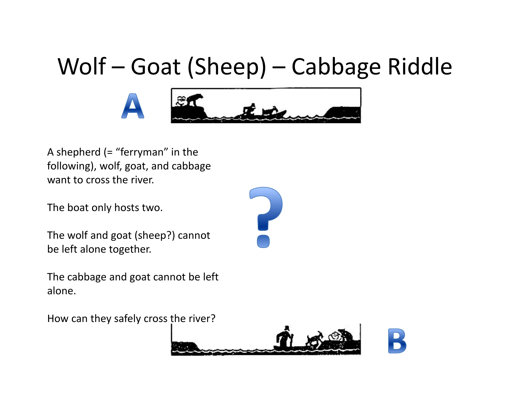
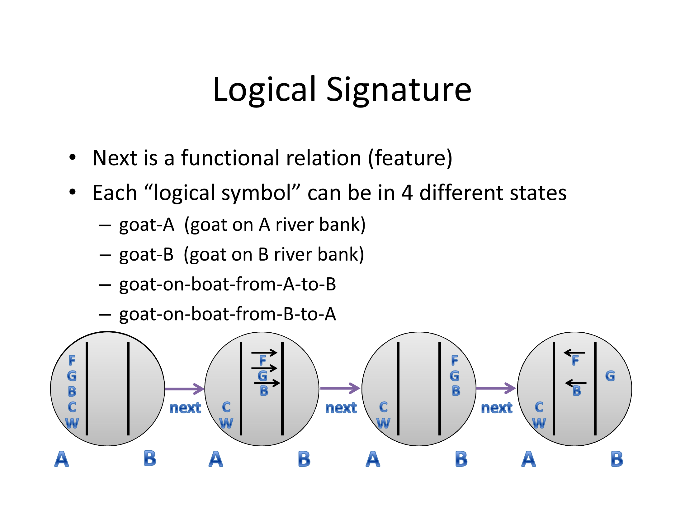
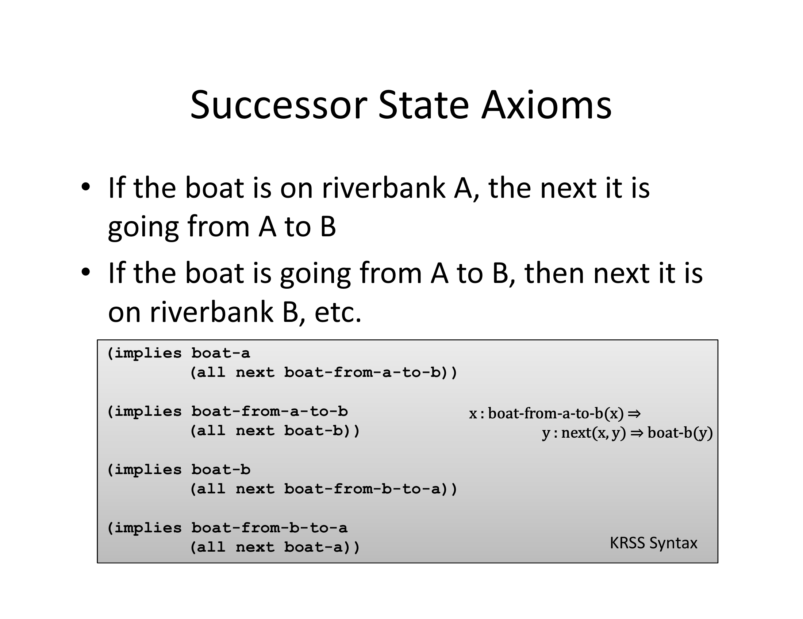
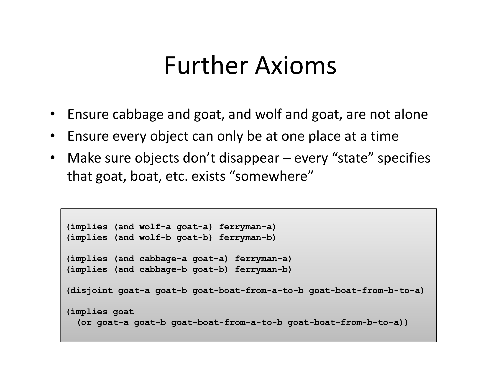
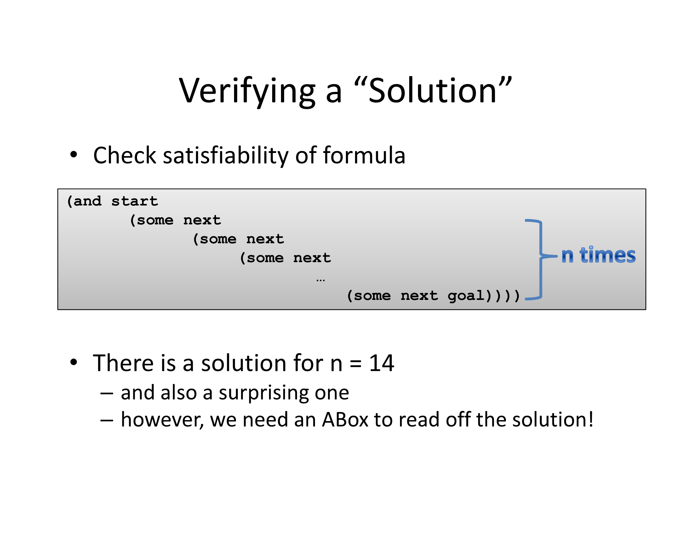
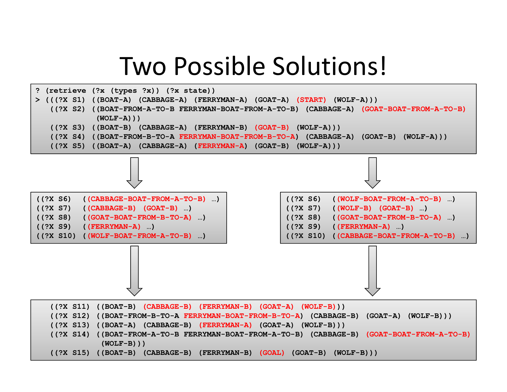
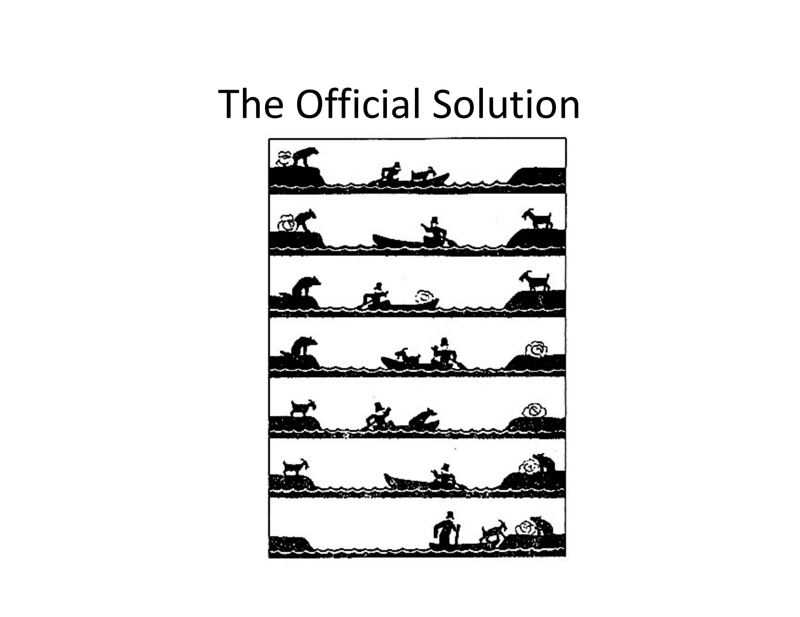

# Using Standard Description Logic Reasoning for SAT Planning

**Exploring Role-Based Encodings of the Wolf-Goat-Cabbage Riddle**

*Michael Wessel & Claude (Anthropic), March 2026*

## Overview

SAT planning reduces planning problems to satisfiability tests: a plan of length *n* exists if and only if the conjunction of start state, goal state, and action axioms is satisfiable. The classical propositional encoding suffers from *symbol proliferation* -- every combination of object and location requires its own propositional variable.

This project investigates whether Description Logic (DL) roles can yield a more compact encoding, using the well-known **Wolf-Goat-Cabbage** river crossing puzzle as a case study. Starting from an existing encoding with atomic concept names in KRSS syntax for the [RacerPro](https://github.com/ha-mo-we/Racer) reasoner, we systematically explore several role-based reformulations, documenting the trade-offs between symbol economy, reasoning performance, and semantic correctness.

## The Puzzle

A ferryman must transport a wolf, a goat, and a cabbage across a river:
- The boat holds at most the ferryman plus one object
- The wolf and goat cannot be left alone (the wolf eats the goat)
- The goat and cabbage cannot be left alone (the goat eats the cabbage)



## Encoding as SAT Planning in Description Logics

States are connected by a functional `next` relation. Each object can be in one of four locations: riverbank A, riverbank B, on the boat going A to B, or on the boat going B to A. Axioms constrain which successor states are legal.







A solution is found by checking satisfiability of a chain of states from start to goal:



The DL reasoner finds two possible solutions:





## Approaches Explored

Each approach is available as a Racer `.racer` file in the `src/` directory.

### `00` -- Original Encoding (Atomic Concepts)

**File:** [`src/00-original.racer`](src/00-original.racer)

The baseline encoding from Wessel (2014). Uses 20+ atomic concept names for object-location combinations (e.g., `goat-a`, `wolf-boat-from-a-to-b`). All axioms have atomic concept names on the left-hand side, enabling effective GCI absorption by the tableau reasoner. Fast and correct, but exhibits symbol proliferation.

### `01` -- Object-Centric Location Roles with Features

**File:** [`src/01-object-centric-roles-with-features.racer`](src/01-object-centric-roles-with-features.racer)

Replaces 20 atomic concepts with 5 functional roles (`goat-loc`, `wolf-loc`, ...) + 4 shared location concepts (`a`, `b`, `from-a-to-b`, `from-b-to-a`) = 9 primitive symbols. Disjointness of locations + features gives per-object uniqueness for free.

**Result:** Too slow. Every axiom with `(some role concept)` on the LHS is a non-absorbable GCI. Features add expensive merge operations.

### `02` -- Defined Concept Abbreviations

**File:** [`src/02-defined-concept-abbreviations.racer`](src/02-defined-concept-abbreviations.racer)

Introduces named concepts as abbreviations: `(define-concept goat-at-a (some goat-loc a))`, etc. Gives the reasoner atomic-like names for optimization.

**Result:** Reintroduces symbol proliferation -- 20 defined concept names, defeating the compactness goal.

### `03` -- Features with Domain/Range and Hints

**File:** [`src/03-features-with-domain-range-hints.racer`](src/03-features-with-domain-range-hints.racer)

Keeps the object-centric roles with features. Adds `:domain state :range location` constraints to help the tableau, plus additional ABox hints at key decision points to prune the search space.

**Result:** Still too slow. The fundamental GCI bottleneck remains.

### `04` -- Nominals/Fills Approach

**File:** [`src/04-nominals-fills-approach.racer`](src/04-nominals-fills-approach.racer)

Pre-declares location individuals in the ABox and uses `(fills role individual)` instead of `(some role concept)`, avoiding anonymous filler creation by the tableau.

**Result:** Racer does not support the `fills` constructor in TBox axioms. Approach abandoned.

### `05` -- No Features, with At-Most Constraints

**File:** [`src/05-no-features-with-at-most.racer`](src/05-no-features-with-at-most.racer)

Drops `:feature` from location roles. Uses `(at-most 1 role)` in the state axiom instead -- scoped to state individuals rather than globally declared.

**Result:** Still too slow. `at-most` is semantically equivalent to features; the reasoner still performs cardinality tracking and merge operations.

### `06` -- No Features, No At-Most

**File:** [`src/06-no-features-no-at-most.racer`](src/06-no-features-no-at-most.racer)

Removes both features and at-most constraints entirely, relying on the axiom structure to naturally produce at most one filler per role (the tableau is lazy).

**Result:** Still too slow, and raises correctness concerns -- without uniqueness enforcement, the safety constraints can be trivially satisfied by duplicating the ferryman at multiple locations.

### `07` -- Location-Centric Roles

**File:** [`src/07-location-centric-roles.racer`](src/07-location-centric-roles.racer)

Inverts the role perspective: instead of objects tracking their locations (`goat-loc`, `wolf-loc`, ...), locations track which objects are at them (`at-a`, `at-b`, `at-ab`, `at-ba`). Safety, capacity, and coupling axioms now all reference a single role per axiom, which may benefit internal indexing.

Also addresses the open-world semantics issue: `(some next state)` in the state axiom can be satisfied by anonymous individuals rather than the explicitly modeled successors. Fix: use `(all next ...)` with `:domain state :range state` on the `next` role.

**Result:** Incorrect without uniqueness enforcement. The ferryman can appear at multiple locations simultaneously because the location-centric roles cannot use features (multiple objects legitimately share a location).

### `08` -- Location-Centric with Per-Object Exclusion (Final)

**File:** [`src/08-location-centric-with-exclusion.racer`](src/08-location-centric-with-exclusion.racer)

Adds 20 per-object location exclusion axioms to enforce that each object is at exactly one location:

```
(implies (some at-a goat)
  (and (not (some at-b goat))
       (not (some at-ab goat))
       (not (some at-ba goat))))
```

Plus 20 labeling axioms for readable query output.

**Result:** Correct and reasonably fast. The working final version.

## Key Lessons

1. **Atomic concepts absorb; role expressions do not.** Axioms with atomic LHS are absorbed into the concept hierarchy (cheap). Axioms with `(some r C)` on the LHS are GCIs checked globally (expensive).

2. **Features are expensive but necessary.** Functional role declarations enable automatic uniqueness but impose merge operations. Dropping them requires explicit exclusion axioms.

3. **Open-world semantics require care.** Use `(all next ...)` rather than `(some next ...)` to ensure constraints apply to explicitly modeled successors.

4. **Location-centric roles cannot use features for uniqueness.** Multiple objects at the same location is legitimate, so per-object uniqueness must be encoded separately.

5. **Compactness vs. performance is a real trade-off.** The original 20-symbol encoding with full absorption remains the pragmatic choice. Role-based encodings offer conceptual clarity at the cost of GCIs.

## Conversation

The full development conversation between Michael Wessel and Claude is available in [`conversation.md`](conversation.md). It documents every design decision, failed attempt, bug discovery, and fix in chronological order.

## Paper

The full paper documenting this journey is available in [`paper/paper.pdf`](paper/paper.pdf) (LaTeX source in [`paper/paper.tex`](paper/paper.tex)).

The original 2014 slides by Michael Wessel are in [`paper/original-slides.pdf`](paper/original-slides.pdf).

## Requirements

- [RacerPro](https://github.com/ha-mo-we/Racer) Description Logic reasoner (or compatible KRSS reasoner)
- Load any `.racer` file and check ABox consistency with `(abox-consistent?)`
- Query solution with `(retrieve (?x (types ?x)) (?x state))`
